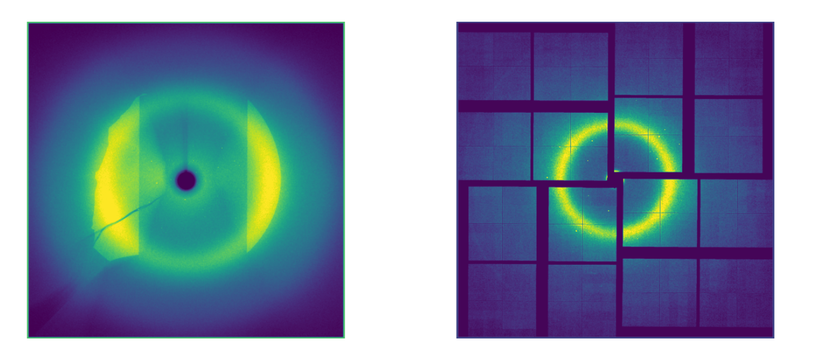

# Diffusion-Guided Autoregressive Models for Preserving Bragg Peaks in XRD Modeling



## Overview

This project develops machine learning-based image compression methods for X-ray diffraction data from the Linac Coherent Light Source (LCLS) at SLAC National Accelerator Laboratory. With LCLS upgrading from 120 to nearly one million pulses per second, there's a critical need for efficient models that can learn the underlying structure of high-resolution (1920×1920 pixel) diffraction images while preserving key scientific features.

The project implements and compares three complementary approaches:
- **Variational Autoencoders (VAE)** - Probabilistic generative models with continuous latent representations
- **Vector-Quantized Variational Autoencoders (VQ-VAE)** - Discrete latent representation learning
- **Masked Autoregressive Models (MAR)** - Transformer-based diffusion-guided autoregressive generation

## Key Scientific Objectives

The models are designed to preserve two crucial structural features in X-ray diffraction images:
- **Bragg Peaks**: Sparse, high-intensity points encoding fine-grained crystalline structure
- **Coarse Ring Structures**: Broader radial patterns indicative of large-scale molecular organization

## Dataset

The project uses real experimental X-ray diffraction data from LCLS:
- **Experiment 422**: 300 runs × 40 images per run
- **Experiment 522**: 179 runs × 40 images per run
- **Image Format**: Single-channel grayscale, 1920×1920 pixels, 14-16 bit depth

## Installation

### Requirements

```bash
# Create conda environment
conda env create -f env.yml
conda activate xrd-autoregression

# Install additional requirements
pip install -r requirements.txt
```

### Dependencies

- PyTorch
- Accelerate (for multi-GPU training)
- Hydra (for configuration management)
- Weights & Biases (for experiment tracking)
- Scientific libraries: numpy, scipy, matplotlib

## Usage

### Basic Training

#### VAE Model
```bash
python run_experiment.py --model_name vae_kl --batch_size 2 --num_epochs 10 \
    --data_id 522 --train_vae_from_scratch --recons_loss iwmse
```

#### VQ-VAE Model
```bash
python run_experiment.py --model_name vq --batch_size 2 --num_epochs 10 \
    --data_id 522 --train_vae_from_scratch --recons_loss iwmse
```

#### Latent Diffusion Model
```bash
python run_experiment.py --model_name vae_kl --latent_diff --batch_size 2 \
    --num_epochs 10 --diff_epochs 5 --data_id 522
```

### Configuration-Based Training (Hydra)

```bash
# Run with default configuration
python run_hydra_experiment.py

# Override specific parameters
python run_hydra_experiment.py model.model_name=vae_kl training.batch_size=4 data.data_id=422
```

### Key Parameters

- `--model_name`: Model type (`vae_kl`, `vq`)
- `--recons_loss`: Reconstruction loss (`mse`, `l1`, `iwmse`)
- `--data_id`: Experiment dataset (422 or 522)
- `--avg_pooling`: Apply average pooling for computational efficiency
- `--use_annealing`: Use KL annealing for VAE training
- `--alpha_mse`: Weight parameter for intensity-weighted MSE loss

## Model Architectures

### Variational Autoencoder (VAE)
- Symmetric encoder-decoder with 4 downsampling/upsampling blocks
- Channel progression: 32 → 64 → 128 → 128
- 3-channel latent bottleneck with optional KL annealing
- Self-attention in mid-block for global context

### Vector-Quantized VAE (VQ-VAE)
- Discrete latent space with learned codebook (256 entries)
- Single-channel latent representation
- Spatial norm regularization
- SiLU activation functions

### Masked Autoregressive Model (MAR)
- Transformer-based encoder-decoder (32 blocks, 1024 hidden width)
- Masked autoregressive learning with random token masking (0.7-1.0 ratio)
- Diffusion-guided generation with Elucidated Diffusion framework
- Progressive inference with cosine decay masking schedule

## Results

### Model Performance

The research demonstrates that:
- **VAE with intensity-weighted MSE** excels at preserving Bragg peaks while maintaining global structure
- **VQ-VAE** provides stable discrete representations but is limited by codebook capacity
- **MAR** shows promise for structured generation but requires careful calibration with VAE decoders

### Loss Functions

Three reconstruction losses were evaluated:
- **L1 Loss**: `||x - x̂||₁`
- **MSE Loss**: `||x - x̂||₂²`
- **Intensity-Weighted MSE**: Emphasizes high-contrast regions crucial for scientific analysis

## File Structure

```
├── models/                    # Model implementations
│   └── mar/                  # MAR model specific code
├── train_utils/              # Training utilities and trainers
├── configs/                  # Hydra configuration files
├── data_preprocessing.py     # Data loading and preprocessing
├── run_experiment.py         # Basic experiment runner
├── run_hydra_experiment.py   # Hydra-based experiment runner
├── plot.py                   # Visualization and sample generation
├── utils.py                  # Utility functions
└── requirements.txt          # Package dependencies
```

## Cluster Usage

For SLAC users, GPU resources can be requested via:

```bash
# Single GPU
srun -p gpu-pascal --gres=gpu:1 --pty bash

# Multiple GPUs
srun -p gpu-turing --gres=gpu:4 --pty bash
```

Use the provided SLURM script:
```bash
sbatch frontier.sbatch
```

## Data Processing

The preprocessing pipeline includes:
1. **Standardization**: Zero mean, unit variance normalization
2. **Edge Masking**: Remove 10-pixel boundary artifacts
3. **Optional Downsampling**: Average pooling for computational efficiency

## Scientific Impact

This work addresses the critical bottleneck in high-throughput X-ray crystallography by:
- Enabling compact representations of diffraction data without losing scientific fidelity
- Preserving both local (Bragg peaks) and global (ring structures) features
- Supporting the upcoming LCLS upgrade to exascale data rates

## Authors

- **Yarong Li** - Stanford University ICME
- **Juan Muneton Gallego** - Stanford University ICME  
- **Cong Wang** - SLAC National Accelerator Laboratory

## Citation

```bibtex
@article{li2024diffusion,
  title={Diffusion-Guided Autoregressive Models for Preserving Bragg Peaks in XRD Modeling},
  author={Li, Yarong and Muneton Gallego, Juan and Wang, Cong},
  year={2024},
  institution={Stanford University and SLAC National Accelerator Laboratory}
}
```

## License

This project is developed for research purposes at Stanford University and SLAC National Accelerator Laboratory.